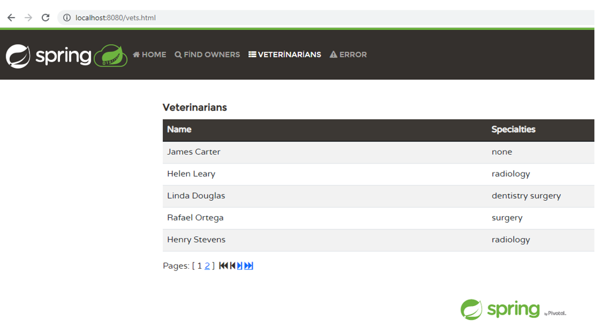
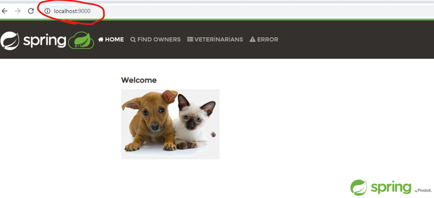
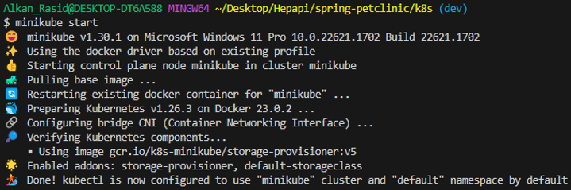
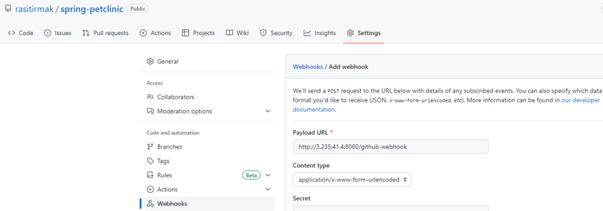
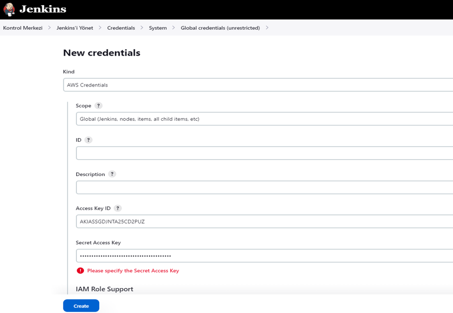

# Project: DevOps Case Study - Junior

# # # # # # # # # # # # # # # # # # # # # # # # # # # # # # #
## MSP 1 - Choose an example app and run it on localhost and Prepare GitHub Repository for the Project
# # # # # # # # # # # # # # # # # # # # # # # # # # # # # # #

* The Java app has been choosen to work from this list:

  Java: https://github.com/spring-projects/spring-petclinic

* Petclinic is a Spring Boot application built using Maven. Firstly Install the Java 17. 

* The source code has been cloned to work locally.

``` bash
git clone https://github.com/spring-projects/spring-petclinic.git
```

* Create a working directory. 

``` bash
cd spring-petclinic
```

* Create a jar file and run it.

``` bash
./mvnw package
java -jar target/*.jar
```

* Access to the app petclinic on localhost:8080



* Clone the petclinic app from the repository [Spring Petclinic App](https://github.com/spring-projects/spring-petclinic).

``` bash
git clone https://github.com/spring-projects/spring-petclinic
```

* Change your working directory to **spring-petclinic** and delete the **.git** directory.

```bash
cd spring-petclinic
rm -rf .git
```

* Create a new repository on your Github account with the name **spring-petclinic**.

*  Initiate the cloned repository to make it a git repository and push the local repository to your remote repository.

```bash
git init
git add .
git commit -m "first commit"
git branch -M main
git remote add origin https://---@https://github.com/rasitirmak/spring-petclinic.git
git push origin main
```
* Prepare base branches namely `main`,  `dev`,  `release` for DevOps cycle.

  + Create `dev` base branch.

    ``` bash
    git checkout main
    git branch dev
    git checkout dev
    git push --set-upstream origin dev
    ```

  + Create `release` base branch.

    ```bash
    git checkout main
    git branch release
    git checkout release
    git push --set-upstream origin release
    ```


# # # # # # # # # # # # # # # # # # # # # # # # # # # # # # #
## MSP 2 - Dockerize the application and  provide a docker compose file to run it locally with just a ‘docker compose up’ command.
# # # # # # # # # # # # # # # # # # # # # # # # # # # # # # #

  + Switch to dev branch

    ```bash
    git checkout dev
    ```


* •	To dockerize the application the create a Dockerfile.

``` Dockerfile
FROM openjdk:17-jdk-slim
ADD ./target/*.jar app.jar
EXPOSE 80
CMD ["java", "-jar", "./app.jar"]
```

* Here's a breakdown of the Dockerfile steps:
  -	openjdk:17-jdk-slim is a base Docker image that contains a minimal Java Runtime Environment (JRE) to run Java 17 applications.
  -	Add all JAR files (*.jar) located in the target directory of the local working directory (./) to the Docker image.
  -	The application within the Docker container will expose port 80 to the outside world.
  -	The command “java -jar ./app.jar” will be executed when the Docker container is run.


*  Create a Docker Image

```bash
docker build -t rasitirmak/spring .
```

*  Create a Docker container with image produced above

```bash
docker run -d -p 9000:8080 rasitirmak/spring
```

*   Docker run a new container based on the "rasitirmak/spring" image and run it in detached mode. The container has been accessible from the host machine at localhost:9000. This is because the -p option is mapping the container's port 8080 to the host's port 9000.



*  Push the created Docker image to Docker Hub to make it available from anywhere.

```bash
docker push rasitirmak/spring
```


*  Provide a docker compose file to run it locally with just a ‘docker compose up’ 

``` yaml
version: '3.7'

services:
   mysqldb:
     image: mysql
     environment:
      MYSQL_DATABASE: spring
      MYSQL_USER: admin
      MYSQL_PASSWORD: ras1234
      MYSQL_ROOT_PASSWORD: ras1234
     networks:
      - webnet

   app:
     depends_on:
       - mysqldb
     image: rasitirmak/spring
     ports:
       - "80:80"
     restart: always
     networks:
       - webnet
     environment:
       DB_SERVER: mysqldb
       DB_USERNAME: admin
       DB_PASS: ras1234
       DB_NAME: spring
networks:
  webnet:
    driver: bridge

```


# # # # # # # # # # # # # # # # # # # # # # # # # # # # # # #
## MSP 4 - Run minikube/kind or any kind of local kubernetes cluster locally. Provide a script and/or the documentation of how to do it.
# # # # # # # # # # # # # # # # # # # # # # # # # # # # # # #

* To run Minikube on local Windows, the following steps have been taken:

  - Install Docker Desktop: Minikube requires a virtualization infrastructure to be installed. Docker Desktop has been installed for this purpose. 
  - Install Minikube: Minikube Windows executable has been downloaded from the official Minikube web site and executed.
  - Open a Command Prompt: A Command Prompt has been opened and run the following command to start Minikube: 

```bash
minikube start
```




# # # # # # # # # # # # # # # # # # # # # # # # # # # # # # #
## MSP 5 - Prepare kubernetes manifests(yaml files) for the application and for the DB of the app. And deploy the DB with a helm chart with a helm command.
# # # # # # # # # # # # # # # # # # # # # # # # # # # # # # #

* Create two different yaml files. One of them is for deploying application and its service (deploymentspring.yaml). And the other one is for database and its service (deploymentmysql.yaml).

* The service of the application make the application accessible via the NodePort. The nodePort field specifies the NodePort number (e.g., 30036) that we will use to access the application.

deploymentspring.yaml
``` yaml
apiVersion: apps/v1
kind: Deployment
metadata:
  name: springapp
  labels:
    app: spring
spec:
  replicas: 1
  selector:
    matchLabels:
      app: spring
  template:
    metadata:
      labels:
        app: spring
    spec:
      containers:
      - name: spring
        image: rasitirmak/rasspring
        ports:
        - containerPort: 80
        env:
        - name: MYSQL_HOST
          value: mysqlsvc
        - name: MYSQL_PORT
          value: "3306"
        - name: MYSQL_DATABASE
          value: springdb
        - name: MYSQL_USERNAME
          value: root
        - name: MYSQL_PASSWORD
          value: "1234"

---
apiVersion: v1
kind: Service
metadata:
  name: springsvc
spec:
  selector:
    app: spring
  type: NodePort
  ports:
  - port: 80
    targetPort: 80
    nodePort: 30036
```

deploymentmysql.yaml
``` yaml
apiVersion: apps/v1
kind: Deployment
metadata:
  name: springapp
  labels:
    app: spring
spec:
  replicas: 1
  selector:
    matchLabels:
      app: spring
  template:
    metadata:
      labels:
        app: spring
    spec:
      containers:
      - name: spring
        image: rasitirmak/rasspring
        ports:
        - containerPort: 80
        env:
        - name: MYSQL_HOST
          value: mysqlsvc
        - name: MYSQL_PORT
          value: "3306"
        - name: MYSQL_DATABASE
          value: springdb
        - name: MYSQL_USERNAME
          value: root
        - name: MYSQL_PASSWORD
          value: "1234"

---
apiVersion: v1
kind: Service
metadata:
  name: springsvc
spec:
  selector:
    app: spring
  type: NodePort
  ports:
  - port: 80
    targetPort: 80
    nodePort: 30036
```

* Create Kubernetes resources by applying the configuration specified in the YAML file the following commands have been used:

``` bash
kubectl apply -f deploymentspring.yaml
kubectl apply -f deploymentmysql.yaml
```

* To get a link and see the application on the browser use the following command.

``` bash
minikube service springsvc –url
```

* To deploy the DB with a helm chart, with a helm command helm was installed on Windows Minikube.

``` bash
choco install kubernetes-helm
helm version
helm repo add stable https://charts.helm.sh/stable	# Add the official Helm stable repository
helm repo update					# Update the local chart repositories
```

* Run the Helm command to deploy MySQL using the stable MySQL Helm chart.

``` bash
helm install mysql-spring stable/mysql \
  --set mysqlRootPassword=pass1234 \
  --set mysqlUser=admin \
  --set mysqlPassword=springpass \
  --set mysqlDatabase=springdb
```

# # # # # # # # # # # # # # # # # # # # # # # # # # # # # # #
## MSP 5 - Prepare a CI pipeline for the application in CI tool Jenkins.
# # # # # # # # # # # # # # # # # # # # # # # # # # # # # # #

* Activate the Github repo Webhooks settings to trigger the pipeline.



* Before building the pipeline push the Dockerfile to the Github Repo.
``` bash
git add .
git commit -m "Dockerfile added"
git push
```

* Deploy the jenkins server on a separate pod with a deployment yaml file given below. 

``` yml
apiVersion: v1
kind: Service
metadata:
  name: jenkins-service
spec:
  type: NodePort
  ports:
    - port: 8080
      targetPort: 8080
      nodePort: 30000
  selector:
    app: jenkins

---
apiVersion: apps/v1
kind: Deployment
metadata:
  name: jenkins-deployment
spec:
  replicas: 1
  selector:
    matchLabels:
      app: jenkins
  template:
    metadata:
      labels:
        app: jenkins
    spec:
      containers:
        - name: jenkins
          image: jenkins/jenkins:jdk17-preview
          ports:
            - containerPort: 8080
          volumeMounts:
            - name: jenkins-home
              mountPath: /var/jenkins_home
      volumes:
        - name: jenkins-home
          emptyDir: {}

```

* To get a link and see the jenkins on the browser use the following command.
``` bash
minikube service jenkins-service –url
```

* To get the initial administration password of the jenkins connect to the Jenkin’s pod.
``` bash
kubectl exec -it jenkins-deployment-694c5849d5-zxdkc -- bash
sudo cat /var/jenkins_home/secrets/initialAdminPassword
```

* Download the plugins given below to achive the desired pipeline on the Jenkins:
  - GitHub Integration
  - Pipeline: GitHub
  - Docker
  - Docker Pipeline
  - Pipeline Utility Steps

* Introduce to Jenkins where maven's executable file is located:
  Name: PATH+EXTRA
  Value: /opt/maven/bin

- Create a ``Jenkins Job`` to Run the CI Pipeline Pipeline scripts.

```yml
- job name: Run the CI Pipeline
- job type: Pipeline
- GitHub project: https://github.com/rasitirmak/spring-petclinic
- Source Code Management: Git
      Repository URL: https://github.com/rasitirmak/spring-petclinic.git
- Branches to build:
      Branch Specifier (blank for 'any'): */dev
- Build Environment: Add timestamps to the Console Output
- Build:
      Add build step: Pipeline Script
```


``` groovy
pipeline {
    agent any

    stages {
        stage('Run the CI Pipeline') {
            steps {
                sh 'git clone https://github.com/rasitirmak/spring-petclinic.git'
                sh 'pwd'
                dir("spring-petclinic") {
                    sh 'chmod +x mvnw'
                    sh './mvnw clean package'
                    sh 'docker build -t spring-petclinic .'
                    sh 'docker login -u rasitirmak -p pass1234'
                    sh 'docker tag spring-petclinic rasitirmak/spring-petclinic'
                    sh 'docker push rasitirmak/spring:1.0'
                }
            }
        }
    }
}
```


# # # # # # # # # # # # # # # # # # # # # # # # # # # # # # #
## MSP 6 - Establish a CI/CD Pipeline on AWS
# # # # # # # # # # # # # # # # # # # # # # # # # # # # # # #


* Create a Jenkins server.
Create a project folder “jenkins_server”. Go to the “jenkins_server” folder and create the files “install-jenkins.tf”, “variables.tf” and “jenkins.sh” into it.

``` bash
mkdir jenkins_server
cd jenkins_server
```

install-jenkins.tf

``` yaml
terraform {
  required_providers {
    aws = {
      source  = "hashicorp/aws"
      version = "~> 4.0"
    }
  }
}

provider "aws" {
  region = "us-east-1"
}

resource "aws_iam_role" "aws_access" {
  name = "awsrole-${var.user}"
  assume_role_policy = jsonencode({
    Version = "2012-10-17"
    Statement = [
      {
        Action = "sts:AssumeRole"
        Effect = "Allow"
        Sid    = ""
        Principal = {
          Service = "ec2.amazonaws.com"
        }
      }
    ]
  })
  managed_policy_arns = ["arn:aws:iam::aws:policy/AmazonEC2ContainerRegistryFullAccess", "arn:aws:iam::aws:policy/AmazonEC2FullAccess", "arn:aws:iam::aws:policy/IAMFullAccess", "arn:aws:iam::aws:policy/AmazonS3FullAccess"]

}

resource "aws_iam_instance_profile" "ec2-profile" {
  name = "jenkins-project-profile-${var.user}"
  role = aws_iam_role.aws_access.name
}

resource "aws_instance" "tf-jenkins-server" {
  ami = var.myami
  instance_type = var.instancetype
  key_name      = var.mykey
  vpc_security_group_ids = [aws_security_group.tf-jenkins-sec-gr.id]
  iam_instance_profile = aws_iam_instance_profile.ec2-profile.name
  tags = {
    Name = var.tag
  }
  user_data = file("jenkins.sh")

}

resource "aws_security_group" "tf-jenkins-sec-gr" {
  name = "${var.jenkins-sg}-${var.user}"
  tags = {
    Name = var.jenkins-sg
  }
  ingress {
    from_port   = 80
    protocol    = "tcp"
    to_port     = 80
    cidr_blocks = ["0.0.0.0/0"]
  }

  ingress {
    from_port   = 22
    protocol    = "tcp"
    to_port     = 22
    cidr_blocks = ["0.0.0.0/0"]
  }

  ingress {
    from_port   = 8080
    protocol    = "tcp"
    to_port     = 8080
    cidr_blocks = ["0.0.0.0/0"]
  }

  egress {
    from_port   = 0
    protocol    = -1
    to_port     = 0
    cidr_blocks = ["0.0.0.0/0"]
  }
}

output "jenkins-server" {
  value = "http://${aws_instance.tf-jenkins-server.public_dns}:8080"
}

```

jenkins.sh
``` yml
#! /bin/bash
yum update -y
hostnamectl set-hostname jenkins-server
yum install git -y
wget -O /etc/yum.repos.d/jenkins.repo https://pkg.jenkins.io/redhat-stable/jenkins.repo
rpm --import https://pkg.jenkins.io/redhat-stable/jenkins.io.key
yum upgrade
amazon-linux-extras install java-openjdk11 -y
yum install jenkins -y
systemctl enable jenkins
systemctl start jenkins
systemctl status jenkins
amazon-linux-extras install docker -y
systemctl start docker
systemctl enable docker
usermod -a -G docker ec2-user
usermod -a -G docker jenkins
cp /lib/systemd/system/docker.service /lib/systemd/system/docker.service.bak
sed -i 's/^ExecStart=.*/ExecStart=\/usr\/bin\/dockerd -H tcp:\/\/127.0.0.1:2375 -H unix:\/\/\/var\/run\/docker.sock/g' /lib/systemd/system/docker.service
systemctl daemon-reload
systemctl restart docker
systemctl restart jenkins
curl -L "https://github.com/docker/compose/releases/download/1.26.2/docker-compose-$(uname -s)-$(uname -m)" \
-o /usr/local/bin/docker-compose
chmod +x /usr/local/bin/docker-compose
# uninstall aws cli version 1
rm -rf /bin/aws
curl "https://awscli.amazonaws.com/awscli-exe-linux-x86_64.zip" -o "awscliv2.zip"
unzip awscliv2.zip
./aws/install
amazon-linux-extras install ansible2 -y
yum install python-boto3 -y
yum install -y yum-utils
yum-config-manager --add-repo https://rpm.releases.hashicorp.com/AmazonLinux/hashicorp.repo
yum -y install terraform

```

variables.tf
```yaml
variable "mykey" {
  default = "MyKeyApr2023"
}
variable "myami" {
  default = "ami-026b57f3c383c2eec"
}
variable "instancetype" {
  default = "t3a.medium"
}
variable "tag" {
  default = "Jenkins_Server"
}
variable "jenkins-sg" {
  default = "jenkins-server-sec-gr-spring"
}

variable "user" {
  default = "rasitirmak"
}

```

* 	Description of Jenkins-server

```yml
- amazon linux 2 instance
- ami-008e1e7f1fcbe9b80
- security group: 
  - 22 for SSH
  - 8080 for Jenkins server
  
- user_data:
  - GIT >>> we run pipeline from github
  - JENKINS
  - DOCKER (install and configure) >>> we build our docker images in jenkins server
  - AWS CLI >>> we run aws cli commands in pipeline
```


* Go to the “jenkins_server” folder and run terraform.

```bash
terraform init
terraform apply
```

* Connect to Jenkins Server and install Kubectl and eksctl  on Amazon Linux 2 via aws cli. Kubernetes Cluster created on EKS with the command below:

```bash
sudo yum update -y
curl -sSL https://raw.githubusercontent.com/helm/helm/master/scripts/get-helm-3 | bash
helm version --short
curl -o kubectl https://s3.us-west-2.amazonaws.com/amazon-eks/1.22.6/2022-03-09/bin/linux/amd64/kubectl

chmod +x ./kubectl

mkdir -p $HOME/bin && cp ./kubectl $HOME/bin/kubectl && export PATH=$PATH:$HOME/bin

echo 'export PATH=$PATH:$HOME/bin' >> ~/.bashrc
```

*	Install eksctl

```bash
curl --silent --location "https://github.com/weaveworks/eksctl/releases/latest/download/eksctl_$(uname -s)_amd64.tar.gz" | tar xz -C /tmp

sudo mv /tmp/eksctl /usr/local/bin
``` 

*	Create Kubernetes Cluster on EKS
```bash
eksctl create cluster \
 --name cwcluster \
 --version 1.22 \
 --region us-east-1 \
 --zones us-east-1a,us-east-1b,us-east-1c \
 --nodegroup-name my-nodes \
 --node-type t3a.medium \
 --nodes 1 \
 --nodes-min 1 \
 --nodes-max 2 \
 --ssh-access \
 --ssh-public-key  ~/.ssh/id_rsa.pub \
 --managed
```

* Access to Jenkins Server and configure it as explained in the previous minikube study. Build the pipeline with the given pipeline script for the CI pipeline:

```groovy

pipeline {
    agent any

    stages {
        stage('Run the CI Pipeline') {
            steps {
	  sh 'git clone https://github.com/rasitirmak/spring-petclinic.git'
                sh 'pwd'
                dir("spring-petclinic") {
                    sh 'chmod +x mvnw'
                    sh './mvnw clean package'
                    sh 'docker build -t spring-petclinic .'
                    sh 'docker login -u rasitirmak -p ****'
                    sh 'docker tag rasitirmak/spring-petclinic:latest rasitirmak/spring-petclinic:1.0'
                    sh 'docker push rasitirmak/spring-petclinic:1.0'
                }
            }
        }
    }
}
```


* For the purpose of the CD stage and the deploying app to AWS EKS Cluster, configure AWS Credentials on the Jenkins Server:



Create the pipeline script given below has:

```groovy
pipeline {
    agent any

    stages {
        stage('Run the CI Pipeline') {
            steps {
                sh 'git clone https://github.com/rasitirmak/spring-petclinic.git'
                sh 'pwd'
                dir("spring-petclinic") {
                    sh 'chmod +x mvnw'
                    sh './mvnw clean package'
                    sh 'docker build -t spring-petclinic .'
                    sh 'docker login -u rasitirmak -p ****'
                    sh 'docker tag rasitirmak/spring-petclinic:latest rasitirmak/spring-petclinic:1.0'
                    sh 'docker push rasitirmak/spring-petclinic:1.0'
                }
            }
        }
        
        stage('Deploy to EKS') {
            steps {
                script {
                    eksCluster = 'cwcluster'
                    eksNamespace = 'default'
                    appName = 'spring-petclinic'
                    imageTag = '3.0'

                    withAWS(credentials: '33b79731-49f2-40a6-8477-afc44fe36b0b') {
                        sh 'aws eks update-service --cluster cwcluster --service my-service --force-new-deployment'
                        sh "aws eks update-kubeconfig --region us-east-1 --name $eksCluster"
                        sh "kubectl config use-context $eksCluster"
                        sh "kubectl set image deployment/$appName $appName=rasitirmak/spring-petclinic:$imageTag --namespace=$eksNamespace"
                    }
                }
            }
        }
    }
}
```


* This pipeline clones the Spring Petclinic repository, builds and packages the application, creates a Docker image, and pushes it to Docker Hub in the "Run the CI Pipeline" stage. Then, in the "Deploy to EKS" stage, it updates the EKS cluster, updates the kubeconfig, and updates the Kubernetes deployment using AWS credentials.

